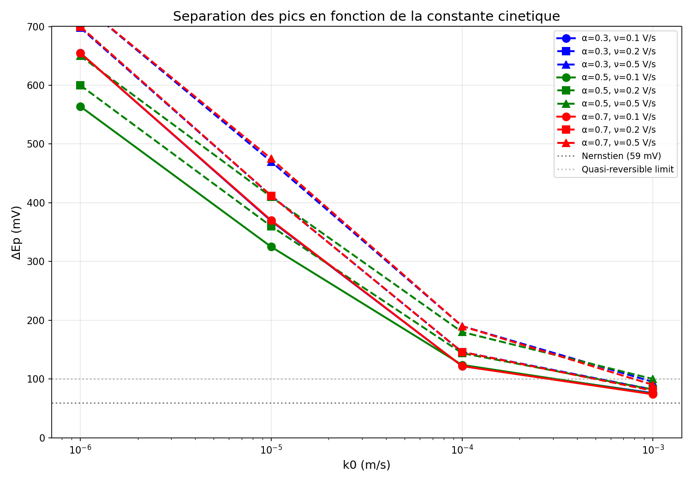

## 1. Résumé des paramètres étudiés

| Paramètre | Valeurs testées |
|-----------|-----------------|
| k⁰ (m/s) | 1e-06, 1e-05, 1e-04, 1e-03 |
| α | 0.3, 0.5, 0.7 |
| scan_rate (V/s) | 0.1, 0.2, 0.5 |

**Paramètres fixes** :
- D = 7.0e-9 m²/s
- c_bulk = 1.0 mol/m³ (1 mM)
- E0 = 0.16 V vs Ag/AgCl (sat. KCl)
- n = 1 électron
- T = 298.15 K (25°C)

---

## 2. Résultats principaux

### 2.1 Effet de k⁰ sur ΔEp

| k⁰ (m/s) | ΔEp moyen (mV) | Régime |
|----------|---------------------|--------|
| 1e-06 | 667 | Irréversible |
| 1e-05 | 400 | Irréversible |
| 1e-04 | 152 | Quasi-réversible |
| 1e-03 | 84 | Réversible |

**Interprétation** :
- k⁰ < 1e-5 m/s : régime irréversible (ΔEp > 200 mV)
- 1e-5 < k⁰ < 1e-3 m/s : régime quasi-réversible (100 < ΔEp < 200 mV)
- k⁰ > 1e-3 m/s : régime réversible/nernstien (ΔEp ~ 59–80 mV)

### 2.2 Effet de α sur le ratio ipa/Ipc

| α | Ratio moyen | Tendance |
|-------|-------------|----------|
| 0.3 | 0.76 | Ipa < Ipc |
| 0.5 | 0.95 | Symétrique |
| 0.7 | 1.20 | Ipc > Ipa |

**Interprétation** :
- α = 0.5 : symétrie optimale (ratio proche de 1.0)
- α < 0.5 : pic anodique relativement plus faible
- α > 0.5 : pic cathodique relativement plus faible

### 2.3 Vérification Randles-Ševčík

La linéarité Ip vs √(scan_rate) est vérifiée pour tous les k⁰ testés,
confirmant un régime de diffusion semi-infinie.

---

## 3. Conclusions

### 3.1 Paramètres optimaux pour simulation CV réaliste

Pour simuler le comportement du système Fe(CN)₆ avec des caractéristiques
proches de l'expérimental :

| Paramètre | Valeur recommandée | Justification |
|-----------|-------------------|---------------|
| k⁰ | 1e-4 m/s | Régime quasi-réversible, ΔEp ~ 120–180 mV |
| α | 0.5 | Symétrie des pics |
| scan_rate | 0.1 V/s | Standard électrochimique |

### 3.2 Validation du modèle

- Le modèle Butler-Volmer capture correctement la transition irréversible → réversible.
- L'effet de α sur l'asymétrie est conforme à la théorie.
- La relation Randles-Ševčík est respectée.

