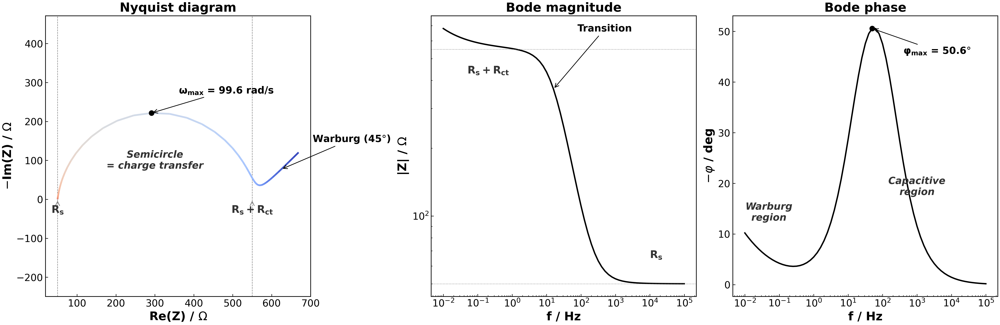
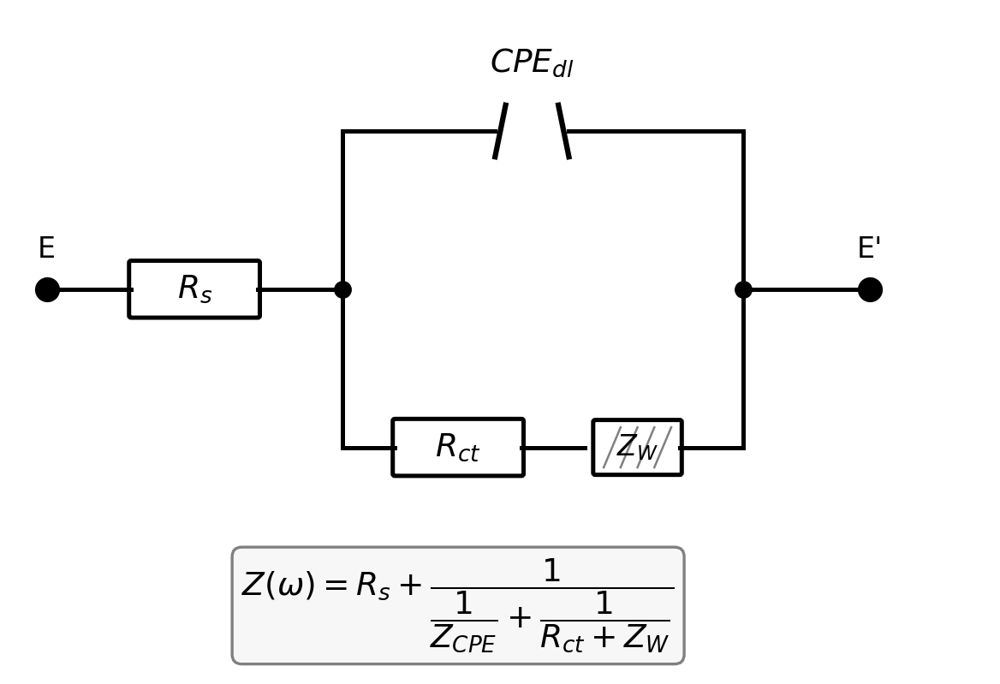

**Sommaire :**
1. Objectif
2. Principe de l'EIS
3. Circuit équivalent : Randles avec CPE
4. Éléments d'impédance
5. Équations de transfert de charge et de diffusion
6. Étude paramétrique : 48 simulations
7. Métriques extraites
8. Références bibliographiques

---

## 1. Objectif

Quantifier l'influence des propriétés intrinsèques d'un couple redox (type ferro/ferricyanure)
sur la réponse en impédance d'une électrode d'or (Au) pure, par étude paramétrique systématique.

L'électrode est fixée (Au pur) et on varie les *propriétés du couple redox* : nombre d'électrons, constante cinétique, coefficient de diffusion, concentration et capacité de double couche.

---

## 2. Principe de l'EIS

Une petite perturbation sinusoïdale de potentiel ($\Delta E = 10$ mV) est superposée au potentiel d'équilibre :

$$E(t) = E_{eq} + \Delta E \cdot \sin(\omega t)$$

La réponse en courant est déphasée d'un angle $\varphi$ :

$$I(t) = \Delta I \cdot \sin(\omega t + \varphi)$$

L'impédance complexe est définie par :

$$Z(\omega) = \frac{\Delta E}{\Delta I} \cdot e^{j\varphi} = Z'(\omega) + j Z''(\omega)$$

Le balayage fréquentiel couvre $f \in [0.01$ Hz$, 100$ kHz$]$ en espacement logarithmique (10 points/décade, 70 points).

### Représentations graphiques

| Diagramme | Axes | Information |
|-----------|------|-------------|
| **Nyquist** | $-\text{Im}(Z)$ vs $\text{Re}(Z)$ | Forme des arcs → mécanismes |
| **Bode magnitude** | $\log\lvert Z\rvert$ vs $\log(f)$ | Résistances limites |
| **Bode phase** | $-\varphi$ vs $\log(f)$ | Constantes de temps |

*Figure — Exemple de spectre EIS (circuit de Randles) : le diagramme de Nyquist (gauche) montre le semicercle de transfert de charge et la droite de Warburg à 45° ; les diagrammes de Bode (centre, droite) montrent les plateaux de résistance et le pic de phase.*

---

## 3. Circuit équivalent : Randles avec CPE

Un seul circuit pour toute l'étude (pas de film passif sur Au pur) :

- **$R_s$** : résistance de la solution (50 Ω, fixe) — chute ohmique dans l'électrolyte KCl 0.1 M
- **$CPE_{dl}$** : double couche électrochimique non idéale ($n_{CPE} = 0.92$ pour Au poli)
- **$R_{ct}$** : résistance de transfert de charge — traduit la cinétique de la réaction redox
- **$Z_W$** : impédance de Warburg — traduit la limitation par la diffusion des espèces

---

## 4. Éléments d'impédance

| Élément | Expression | Paramètres |
|---------|------------|------------|
| Résistance | $Z_R = R$ | $R$ (Ω) |
| CPE | $Z_{CPE} = \frac{1}{Q_0 (j\omega)^n}$ | $Q_0$ (F·s^(n-1)), $n \in [0,1]$ |
| Warburg | $Z_W = \frac{\sigma}{\sqrt{\omega}}(1-j)$ | $\sigma$ (Ω·s⁻⁰·⁵) |

**CPE** (*Constant Phase Element*) : modélise une capacité non idéale. Quand $n = 1$, le CPE est une capacité pure ; quand $n < 1$, il traduit l'hétérogénéité microscopique de la surface. Sur Au poli, $n \approx 0.92$.

**Circuit de Randles complet** :

$$Z(\omega) = R_s + \frac{1}{\frac{1}{Z_{CPE}} + \frac{1}{R_{ct} + Z_W}}$$

---

## 5. Équations de transfert de charge et de diffusion

### Résistance de transfert de charge

$R_{ct}$ est la résistance associée à la réaction d'oxydoréduction à l'interface électrode/solution. Elle dépend directement de la cinétique du couple redox :

$$R_{ct} = \frac{RT}{n_{el}^2 F^2 A \, k^0 \, c}$$

| Symbole | Grandeur | Valeur / unité |
|---------|----------|----------------|
| $R$ | Constante des gaz parfaits | 8.314 J/(mol·K) |
| $T$ | Température | 293.15 K (20°C) |
| $n_{el}$ | Nombre d'électrons transférés | 1 ou 3 |
| $F$ | Constante de Faraday | 96 485 C/mol |
| $A$ | Surface de l'électrode de travail | $1.77 \times 10^{-6}$ m² |
| $k^0$ | Constante de vitesse standard | $10^{-5}$ à $10^{-3}$ m/s |
| $c$ | Concentration des espèces électroactives | 1 ou 10 mol/m³ |

**Effet physique** : $R_{ct}$ diminue quand $k^0$, $c$ ou $n_{el}$ augmentent. Pour $k^0$ élevé, $R_{ct} \to 0$ et le semicercle de Nyquist disparaît.

### Coefficient de Warburg

$\sigma$ caractérise la limitation par la diffusion des espèces entre le bulk et l'électrode. Pour un couple équimolaire ($c_O = c_R = c$, $D_O = D_R = D$) :

$$\sigma = \frac{RT}{n_{el}^2 F^2 A \sqrt{2}} \cdot \frac{2}{\sqrt{D} \cdot c}$$

**Effet physique** : $\sigma$ diminue quand $D$ ou $c$ augmentent. Un grand $\sigma$ produit une droite de Warburg à 45° dominante sur le Nyquist.

### Conversion de $Q_0$

L'utilisateur fournit $Q_0$ en µF/cm² ; la conversion vers le SI tient compte de la surface de l'électrode :

$$Q_{0,SI} = Q_0 [\mu\text{F/cm}^2] \times 10^{-6} \times A [\text{cm}^2]$$

### Capacité effective

Au sommet du semicercle de Nyquist (pulsation $\omega_{max}$), la relation avec la capacité de double couche est :

$$C_{dl,eff} = \frac{1}{\omega_{max} \cdot R_{ct}}$$

---

## 6. Étude paramétrique : 48 simulations

| Paramètre | Symbole | Niveaux | Unité SI | Effet physique |
|-----------|---------|---------|----------|----------------|
| Nb d'électrons | $n_{el}$ | 1, 3 | — | n=3 divise $R_{ct}$ et $\sigma$ par 9 (facteur $n^2$) |
| Constante de vitesse | $k^0$ | $10^{-5}$, $10^{-4}$, $10^{-3}$ | m/s | $k^0$ élevé → $R_{ct}$ petit (réversible) |
| Coeff. diffusion | $D$ | $7 \times 10^{-10}$, $7 \times 10^{-9}$ | m²/s | $D$ élevé → $\sigma$ petit (diffusion rapide) |
| Concentration | $c$ | 1, 10 | mol/m³ | $c$ élevé → $R_{ct}$ et $\sigma$ petits |
| Capacité DL | $Q_0$ | 10, 100 | µF/cm² | Affecte $\omega_{max}$ et $C_{dl,eff}$, pas $R_{ct}$ |

**Température fixée** : $T = 293.15$ K (20°C).

**Surface de l'électrode** : $A = 1.77 \times 10^{-6}$ m² (identique aux Études 1–3).

**Total** : $2 \times 3 \times 2 \times 2 \times 2 = 48$ runs

---

## 7. Métriques extraites

| Métrique | Extraction | Unité |
|----------|-----------|-------|
| $R_s$ | Intercept HF de $\text{Re}(Z)$ | Ω |
| $R_{ct}$ | Diamètre du semicercle | Ω |
| $\omega_{max}$ | Pulsation au sommet du semicercle | rad/s |
| $C_{dl,eff}$ | $1/(\omega_{max} \cdot R_{ct})$ | F |
| $\sigma_{fit}$ | Pente de la droite de Warburg | Ω·s⁻⁰·⁵ |
| $-\varphi_{max}$ | Maximum de la phase | ° |

---

## 8. Références bibliographiques

*Pour la liste complète des références, consultez la section Références bibliographiques dans le menu Annexes.*
